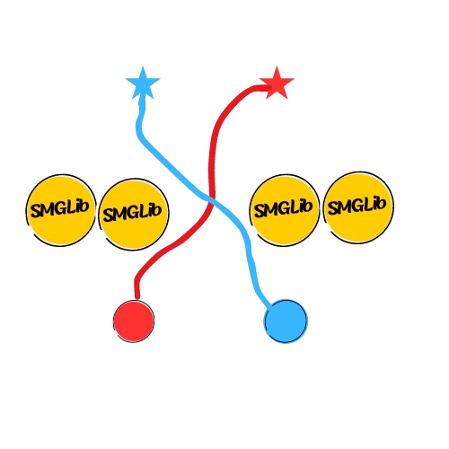

# SMGLib: Social Multi-Agent Navigation Library

<p align="center">
  
</p>


## Overview

**SMGLib** is a comprehensive Python library for multi-agent social navigation research and simulation. It provides a unified framework for testing, comparing, and analyzing different collision avoidance algorithms in complex social scenarios like doorways, hallways, and intersections.

### Key Features

🤖 **Multiple Navigation Algorithms**: Implements state-of-the-art methods including Social-ORCA, Social-IMPC-DR, and Social-CADRL

📊 **Comprehensive Metrics**: Automatic calculation of performance metrics including path deviation, velocity smoothness, makespan ratios, flow rates, and success rates

🎯 **Standardized Environments**: Consistent scenario configurations across all methods for fair comparison

🎬 **Rich Visualizations**: Generates GIF animations, trajectory plots, and SVG visualizations

⚡ **Easy-to-Use Interface**: Simple command-line interface with interactive configuration

## Research Foundation

The algorithms implemented in SMGLib are based on the following peer-reviewed publications:

### Social-ORCA Implementation
* **S. Dergachev and K. Yakovlev**, "Distributed Multi-Agent Navigation Based on Reciprocal Collision Avoidance and Locally Confined Multi-Agent Path Finding," in *Proceedings of the 17th International Conference on Automation Science and Engineering (CASE 2021)*, Lyon, France, 2021, pp. 1489-1494. [[pdf](https://arxiv.org/pdf/2107.00246.pdf)]

### Social-IMPC-DR Implementation
* **Wenhao Luo, Wen Sun, and Ashish Kapoor**, "Multi-Robot Collision Avoidance under Uncertainty with Probabilistic Safety Barrier Certificates," *Proceedings of Neural Information Processing Systems (NeurIPS)*, 2020. [[pdf](https://proceedings.neurips.cc/paper/2020/file/03793ef7d06ffd63d34ade9d091f1ced-Paper.pdf)]

* **A. Patwardhan, R. Murai and A. J. Davison**, "Distributing Collaborative Multi-Robot Planning With Gaussian Belief Propagation," in *IEEE Robotics and Automation Letters*, vol. 8, no. 2, pp. 552-559, Feb. 2023, doi: 10.1109/LRA.2022.3227858. [[pdf](https://arxiv.org/pdf/2203.11618.pdf)]

### Social-CADRL Implementation
* **M. Everett, Y. Chen, and J. P. How**, "Collision Avoidance in Pedestrian-Rich Environments with Deep Reinforcement Learning," *IEEE Access* Vol. 9, 2021, pp. 10357-10377. [[pdf](https://arxiv.org/pdf/1910.11689.pdf)]

* **M. Everett, Y. Chen, and J. P. How**, "Motion Planning Among Dynamic, Decision-Making Agents with Deep Reinforcement Learning," *IEEE/RSJ International Conference on Intelligent Robots and Systems (IROS)*, 2018. [[pdf](https://arxiv.org/pdf/1703.08862.pdf)]

### Additional Methods
* **Davis, Bobby, Ioannis Karamouzas, and Stephen J. Guy**, "NH-TTC: A gradient-based framework for generalized anticipatory collision avoidance," *arXiv preprint arXiv:1907.05945*, 2019. [[pdf](http://motion.cs.umn.edu/r/NH-TTC/)]

## Quick Start

### 1. Installation

Clone the repository:
```bash
git clone https://github.com/CRAL-UVA/SMGLib.git
cd SMGLib
```

Install dependencies:
```bash
pip install -r requirements.txt
```

### 2. Run Your First Simulation

```bash
python3 run_simulation.py
```

This launches an interactive menu where you can:
- Choose a navigation method (Social-ORCA, Social-IMPC-DR, or Social-CADRL)
- Select an environment (doorway, hallway, intersection)
- Configure agents and parameters
- View results and animations

### 3. Example Results

After running a simulation, you'll see results like:

```
SOCIAL-IMPC-DR RESULTS
Environment: doorway  Success Rate: 100.0% (2/2)  Makespan: 15.00s  Flow Rate: 0.1667

Agent     TTG  MR     Avg ΔV  Path Dev  Hausdorff
Robot 0   45   1.000  1.576   28.488    0.145   
Robot 1   47   1.044  1.576   28.493    0.146  
```

## Available Methods

### 1. Social-ORCA
**Optimal Reciprocal Collision Avoidance** - A velocity-based collision avoidance method that guarantees collision-free navigation in multi-agent environments.

*Features:*
- Real-time collision avoidance
- Distributed decision making
- Minimal computational overhead


### 2. Social-IMPC-DR
**Iterative Model Predictive Control with Deadlock Resolution** - Advanced predictive control method with explicit deadlock detection and resolution mechanisms.

*Features:*
- Predictive trajectory planning
- Deadlock detection and resolution
- Optimization-based approach


### 3. Social-CADRL
**Collision Avoidance with Deep Reinforcement Learning** - Deep learning-based approach trained on diverse social navigation scenarios.

*Features:*
- Learning-based navigation policies
- Adaptable to novel scenarios
- Human-like behavior patterns


## Supported Environments

### Doorway Scenario
Agents navigate through a narrow doorway, requiring coordination to avoid deadlocks.

### Hallway Scenario
Bidirectional traffic flow in a constrained hallway environment.

### Intersection Scenario
Complex multi-directional navigation through intersection points.

## Walkthrough: Running a Complete Simulation

### Step 1: Launch the Simulator
```bash
python3 run_simulation.py
```

### Step 2: Select Method and Environment
```
Welcome to the Multi-Agent Navigation Simulator
=============================================

Available Methods:
1. Social-ORCA
2. Social-IMPC-DR  
3. Social-CADRL

Enter method number (1-3): 2

Available environments:
1. doorway
2. hallway
3. intersection

Enter environment type (1-3): 1
```

### Step 3: Choose Output Format
```
Output format options:
1. Clean (minimal text output)
2. Verbose (detailed output with explanations)

Enter output format (1-2): 1
```

### Step 4: Configure Simulation (for ORCA)
For Social-ORCA, you'll configure:
- Number of robots (1-4)
- Start and goal positions for each robot
- Environment-specific constraints

### Step 5: View Results
The simulation generates:
- **Performance metrics** displayed in terminal
- **Animation files** in `logs/[method]/animations/`

### Step 6: Examine Outputs

**Terminal Results:**
```
SOCIAL-IMPC-DR RESULTS
Environment: doorway  Success Rate: 100.0% (2/2)  Makespan: 15.00s  Flow Rate: 0.1667

Agent     TTG  MR     Avg ΔV  Path Dev  Hausdorff
Robot 0   45   1.000  1.576   28.488    0.145   
Robot 1   47   1.044  1.576   28.493    0.146  
```

## Performance Metrics Explained

### Primary Metrics

| Metric | Description | Interpretation |
|--------|-------------|----------------|
| **Success Rate** | Percentage of agents reaching goals | Higher = better deadlock avoidance |
| **Makespan** | Time for all agents to complete | Lower = more efficient |
| **Flow Rate** | Agents per unit time through bottleneck | Higher = better throughput |

### Per-Agent Metrics

| Metric | Description | Formula |
|--------|-------------|---------|
| **TTG** | Time To Goal (steps) | Steps until goal reached |
| **MR** | Makespan Ratio | TTG_agent / TTG_fastest |
| **Avg ΔV** | Average velocity change | Σ\|v(t+1) - v(t)\| |
| **Path Dev** | Path deviation from nominal | L2 norm of trajectory difference |
| **Hausdorff** | Maximum deviation distance | max distance between trajectories |


---

**SMGLib** - Advancing multi-agent navigation research through comprehensive simulation and analysis tools.
